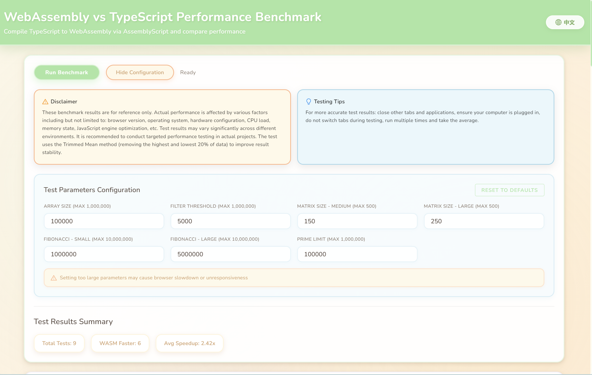
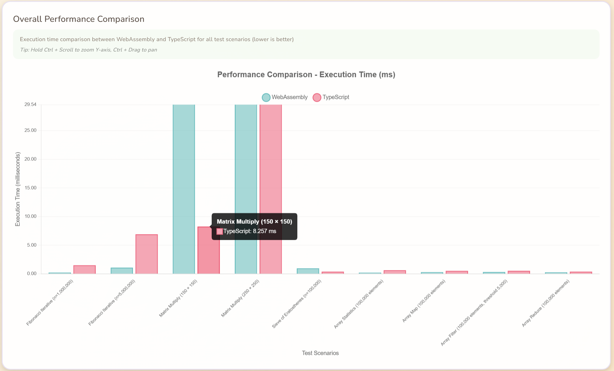
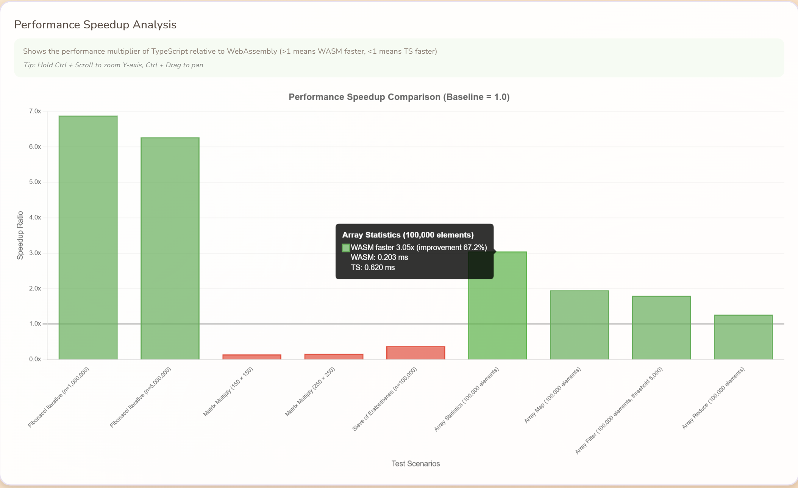
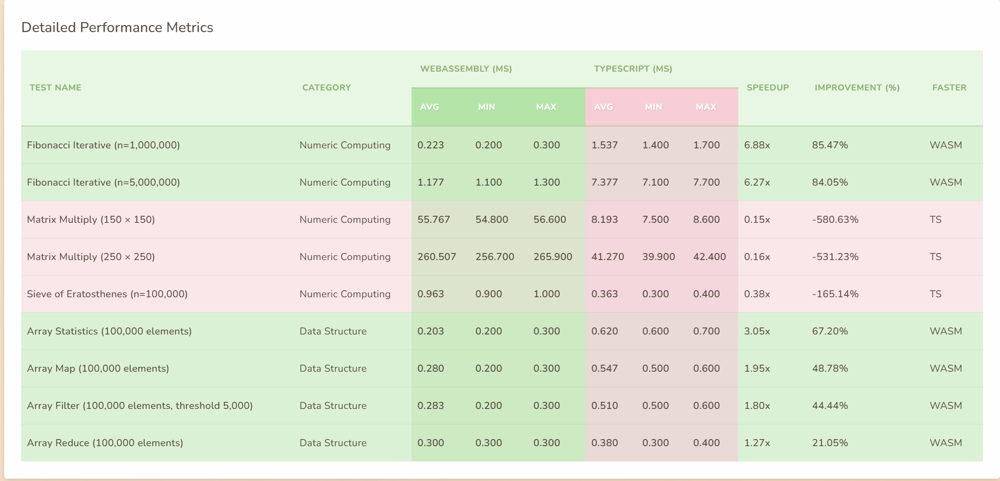

# WebAssembly vs TypeScript Performance Benchmark

<div align="center">

[](https://fqfangqi.github.io/wasm-vs-ts/)
[](LICENSE)
[](https://reactjs.org/)
[](https://www.typescriptlang.org/)
[](https://www.assemblyscript.org/)

A comprehensive performance benchmark comparing WebAssembly (via AssemblyScript) with TypeScript, featuring interactive visualizations and configurable test scenarios.

通过 AssemblyScript 将 TypeScript 代码编译为 WebAssembly，对比性能差异的全面基准测试工具。

**[🚀 View Live Demo | 查看在线演示](https://fqfangqi.github.io/wasm-vs-ts/)**

</div>

---

## 📖 Documentation | 文档

Choose your language | 选择你的语言：

### English Documentation

**[📘 Read Full Documentation →](docs/README.md)**

- Complete feature introduction
- Detailed usage guide
- API references and examples
- Performance insights and best practices

### 中文文档

**[📕 阅读完整文档 →](docs/README.zh-CN.md)**

- 完整功能介绍
- 详细使用指南
- API 参考和示例
- 性能洞察和最佳实践

---

## 🚀 Quick Start | 快速开始

```bash
# Clone the repository | 克隆仓库
git clone https://github.com/FQFangQi/wasm-vs-ts.git
cd wasm-vs-ts

# Install dependencies | 安装依赖
npm install

# Compile WebAssembly | 编译 WebAssembly
npm run asbuild

# Start development server | 启动开发服务器
npm run dev
```

Open your browser to `http://localhost:5173`

在浏览器中打开 `http://localhost:5173`

---

## ✨ Key Features | 核心特性

- 🔬 **Comprehensive Testing** | **全面测试**: Numeric computing, data structures, and more
- 📊 **Interactive Visualization** | **交互式可视化**: Beautiful charts with zoom and pan
- ⚡ **Real-time Benchmarking** | **实时基准测试**: Run tests directly in browser
- 📈 **Detailed Metrics** | **详细指标**: Average, min, max, speedup ratios
- 💾 **Export Data** | **数据导出**: CSV and JSON format support
- 🌍 **i18n Support** | **国际化**: English and Chinese

---

## 📸 Preview | 预览

<table>
  <tr>
    <td align="center">
      
      <br/>
      <b>Main Interface | 主界面</b>
    </td>
    <td align="center">
      
      <br/>
      <b>Performance Comparison | 性能对比</b>
    </td>
  </tr>
  <tr>
    <td align="center">
      
      <br/>
      <b>Speedup Analysis | 加速比分析</b>
    </td>
    <td align="center">
      
      <br/>
      <b>Detailed Metrics | 详细指标</b>
    </td>
  </tr>
</table>

---

## 🛠 Tech Stack | 技术栈

- **Frontend** | **前端**: React 19 + TypeScript + Vite
- **WebAssembly**: AssemblyScript 0.28+
- **Charts** | **图表**: Chart.js + chartjs-plugin-zoom
- **i18n** | **国际化**: i18next + react-i18next

---

## 📚 Documentation Structure | 文档结构

```
docs/
├── README.md              # English full documentation | 英文完整文档
├── README.zh-CN.md        # Chinese full documentation | 中文完整文档
├── QUICK_START.md         # Quick start guide | 快速开始指南
└── images/                # Screenshots | 截图
    ├── en/               # English screenshots | 英文截图
    └── zh/               # Chinese screenshots | 中文截图
```

---

## 🤝 Contributing | 贡献

Contributions are welcome! Please see our documentation for more details.

欢迎贡献！详见完整文档。

---

## 📄 License | 许可证

This project is licensed under the MIT License - see the [LICENSE](LICENSE) file for details.

本项目采用 MIT 许可证 - 详见 [LICENSE](LICENSE) 文件。

---

## 🙏 Acknowledgments | 致谢

- The stars given by friends | 各位朋友送的 star
- The AssemblyScript community | AssemblyScript 社区
- All contributors | 所有贡献者

---

<div align="center">

**[📘 English Docs](docs/README.md)** | **[📕 中文文档](docs/README.zh-CN.md)**

Made with ❤️ by the community | 用 ❤️ 打造，源自社区

</div>
