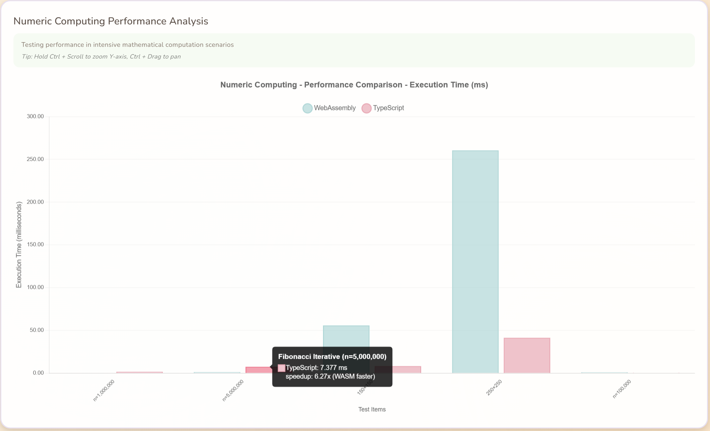
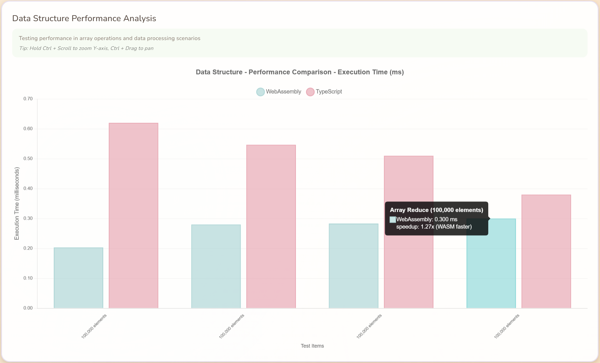
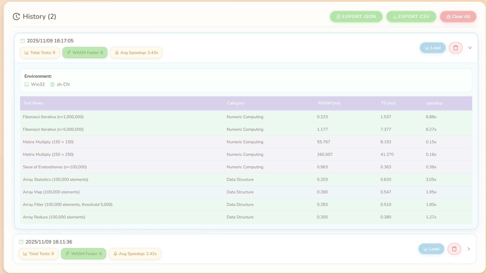

# WebAssembly vs TypeScript Performance Benchmark

<div align="center">

[](https://fqfangqi.github.io/wasm-vs-ts/)
[](../LICENSE)
[](https://reactjs.org/)
[](https://www.typescriptlang.org/)
[](https://www.assemblyscript.org/)

A comprehensive performance benchmark comparing WebAssembly (via AssemblyScript) with TypeScript, featuring interactive visualizations and configurable test scenarios.

**[中文文档](README.zh-CN.md)** | **English**

</div>

---

## 📋 Overview

This project provides a comprehensive performance comparison between **WebAssembly** (compiled from TypeScript via AssemblyScript) and native **TypeScript** code execution. It includes a modern web interface with real-time benchmarking, interactive charts, and detailed performance metrics.

**Live Demo**: https://fqfangqi.github.io/wasm-vs-ts/

## ✨ Features

- 🔬 **Comprehensive Testing**: Covers numeric computing, string processing, and data structure operations
- 📊 **Interactive Visualization**: Beautiful charts powered by Chart.js with zoom and pan capabilities
- 🔍 **Chart Zoom & Pan**: Hold `Ctrl` + Scroll to zoom Y-axis, `Ctrl` + Drag to pan
- ⚡ **Real-time Benchmarking**: Run tests directly in your browser with live progress updates
- 📈 **Detailed Metrics**: Shows average, min, max, standard deviation, and speedup ratios
- 💾 **Export Data**: Export results to CSV or JSON format
- ⚙️ **Configurable Parameters**: Customize test data sizes and scenarios
- 🛡️ **Safe Limits**: Built-in parameter limits prevent browser freezing
- 🌍 **i18n Support**: English and Chinese language support
- 📜 **History Tracking**: Save and compare multiple test runs

## 📸 Screenshots

### Main Interface


The main interface provides an intuitive layout with configuration panel, disclaimer, testing tips, and test results summary.

### Overall Performance Comparison


Visual comparison of execution times between WebAssembly and TypeScript across all test scenarios.

### Numeric Computing Performance



Performance analysis for intensive mathematical computation scenarios including Fibonacci, Matrix Multiplication, and Sieve of Eratosthenes.

### Data Structure Performance



Performance testing for array operations and data processing scenarios.

### Performance Speedup Analysis


Shows the performance multiplier of TypeScript relative to WebAssembly (>1 means WASM is faster).

### Detailed Performance Metrics


Comprehensive table showing average, min, max times, speedup ratios, and improvement percentages for all test scenarios.

### History Tracking



Save and compare multiple test runs with detailed environment information.

## 🧪 Test Scenarios

### Numeric Computing

- **Fibonacci** (Iterative): Tests loop performance and integer arithmetic
- **Matrix Multiplication**: Evaluates nested loop efficiency and floating-point operations
- **Sieve of Eratosthenes**: Prime number calculation algorithm testing

### Data Structure Operations

- **Array Statistics**: Sum, mean, min, max calculations on large arrays
- **Array Map**: Transform operations on array elements
- **Array Filter**: Conditional filtering of array elements
- **Array Reduce**: Accumulation operations on arrays

## 🛠 Tech Stack

- **Frontend Framework**: React 19 + TypeScript
- **Build Tool**: Vite
- **WebAssembly**: AssemblyScript 0.28+
- **Charts**: Chart.js + react-chartjs-2 + chartjs-plugin-zoom
- **Internationalization**: i18next + react-i18next
- **Styling**: CSS3

## 🚀 Quick Start

### Prerequisites

- Node.js 18+ and npm
- Modern browser with WebAssembly support

### Installation

```bash
# Clone the repository
git clone https://github.com/FQFangQi/wasm-vs-ts.git
cd wasm-vs-ts

# Install dependencies
npm install
```

### Compile WebAssembly Module

```bash
npm run asbuild
```

This generates optimized WASM modules in the `build/` directory (both debug and release versions).

### Start Development Server

```bash
npm run dev
```

Open your browser to the displayed local address (typically `http://localhost:5173`).

### Build for Production

```bash
npm run build
```

The production-ready files will be in the `dist/` directory.

### Preview Production Build

```bash
npm run preview
```

## 📝 How to Use

1. **Configure Parameters** (Optional):
   - Click the "Configuration" button to open the parameter panel
   - Adjust test parameters like array size, matrix dimensions, etc.
   - Parameters are automatically limited to safe ranges
   - Click "Reset to Defaults" to restore default values

2. **Run Benchmarks**:
   - Click "Run Benchmark" button
   - Wait for tests to complete (progress shown in real-time)

3. **View Results**:
   - **Charts**: Visual comparison of execution times
     - Use `Ctrl` + Scroll to zoom Y-axis
     - Use `Ctrl` + Drag to pan chart
     - Double-click to reset view
   - **Tables**: Detailed performance metrics
   - **Summary**: Overall statistics and speedup ratios
   - Green indicators: WASM is faster
   - Red indicators: TypeScript is faster

4. **Export Data**:
   - Click "Export CSV" for spreadsheet-compatible format
   - Click "Export JSON" for machine-readable format

5. **History**:
   - View previous test results
   - Load and compare different runs
   - Clear history when needed

## 📊 Understanding the Metrics

- **Average Time**: Mean execution time across multiple iterations
- **Min/Max Time**: Fastest/slowest execution times recorded
- **Standard Deviation**: Measure of performance consistency (lower is more stable)
- **Speedup Ratio**: TypeScript time ÷ WASM time (>1 means WASM is faster)
- **Performance Improvement**: Percentage improvement of WASM over TypeScript

> **Note**: Results use the Trimmed Mean method (removes highest and lowest 20% of samples) for improved accuracy and stability.

## ⚙️ Configuration Limits

To prevent browser freezing, the following maximum limits are enforced:

- **Array Size**: 1,000,000 elements
- **Matrix Size**: 500 × 500
- **Fibonacci N**: 10,000,000
- **Prime Limit**: 1,000,000

## 📁 Project Structure

```
wasm-vs-ts/
├── assembly/                  # AssemblyScript source code
│   ├── index.ts              # WASM entry point
│   ├── numeric.ts            # Numeric computing tests
│   ├── datastructure.ts      # Data structure tests
│   └── tsconfig.json
├── src/                      # React frontend source
│   ├── components/
│   │   ├── BenchmarkRunner.tsx    # Test runner component
│   │   ├── ResultsChart.tsx       # Chart visualization
│   │   ├── MetricsTable.tsx       # Results table
│   │   └── History.tsx            # History tracking
│   ├── benchmarks/           # TypeScript implementations
│   │   ├── numeric.ts
│   │   └── datastructure.ts
│   ├── utils/
│   │   ├── benchmark.ts      # Benchmarking utilities
│   │   ├── wasm-loader.ts    # WASM loader
│   │   └── storage.ts        # LocalStorage utilities
│   ├── i18n/                 # Internationalization
│   │   ├── index.ts
│   │   └── locales/
│   │       ├── en.ts
│   │       └── zh.ts
│   ├── types.ts              # TypeScript type definitions
│   ├── App.tsx
│   └── main.tsx
├── build/                    # Compiled WASM files
├── dist/                     # Production build output
├── docs/                     # Documentation
│   ├── images/              # Screenshots
│   │   ├── en/              # English screenshots
│   │   └── zh/              # Chinese screenshots
│   ├── README.md            # English documentation
│   └── README.zh-CN.md      # Chinese documentation
├── public/
├── package.json
├── vite.config.ts
├── asconfig.json             # AssemblyScript config
└── README.md
```

## 🧩 Adding Custom Tests

### 1. Add WebAssembly Implementation

Edit `assembly/numeric.ts` or `assembly/datastructure.ts`:

```typescript
export function myCustomTest(n: i32): i32 {
  // Your implementation
  return result;
}
```

Export in `assembly/index.ts`:

```typescript
export { myCustomTest } from './numeric';
```

Recompile:

```bash
npm run asbuild
```

### 2. Add TypeScript Implementation

Edit `src/benchmarks/numeric.ts` or `src/benchmarks/datastructure.ts`:

```typescript
export function myCustomTest(n: number): number {
  // Same logic as WASM version
  return result;
}
```

### 3. Add Test Suite

In `src/components/BenchmarkRunner.tsx`, add to both `wasmSuites` and `tsSuites`:

```typescript
{
  name: 'My Custom Test',
  category: 'Numeric Computing',
  testFn: () => wasm.myCustomTest(1000)
}
```

## 💡 Performance Insights

### When to Use WebAssembly

✅ **Good Use Cases**:
- CPU-intensive computations
- Cryptography and encryption
- Image/video/audio processing
- Game engines and physics simulations
- Scientific computing and data analysis
- Porting existing C/C++/Rust code

❌ **Not Recommended**:
- DOM manipulation
- Simple business logic
- Frequent JavaScript interop
- String-heavy operations (high overhead in WASM)
- Small, short-lived computations

### Optimization Tips

1. **Minimize WASM-JS Boundary Crossings**: Batch data transfers and reduce function call frequency
2. **Use Appropriate Data Types**: Leverage WASM's static typing for performance
3. **Optimize Memory Access**: Sequential memory access is faster than random access
4. **Choose Right Optimization Level**: Balance compile time vs runtime performance
5. **Profile First**: Always measure before optimizing

## 📖 Best Practices

- **Test in Target Environments**: Performance varies across browsers and devices
- **Close Background Apps**: For accurate benchmarks, minimize system load
- **Run Multiple Times**: Average results from multiple runs for consistency
- **Use Release Build**: Always benchmark WASM release builds, not debug builds
- **Consider Bundle Size**: WASM adds to your application bundle

## 🌐 Browser Compatibility

- ✅ Chrome/Edge 57+ (Recommended)
- ✅ Firefox 52+
- ✅ Safari 11+
- ✅ Opera 44+
- ⚠️ Requires WebAssembly support

## 🤝 Contributing

Contributions are welcome! Please feel free to submit issues and pull requests.

1. Fork the repository
2. Create your feature branch (`git checkout -b feature/amazing-feature`)
3. Commit your changes (`git commit -m 'Add some amazing feature'`)
4. Push to the branch (`git push origin feature/amazing-feature`)
5. Open a Pull Request

## 📄 License

This project is licensed under the MIT License - see the [LICENSE](../LICENSE) file for details.

## 📚 Resources

- [AssemblyScript Documentation](https://www.assemblyscript.org/)
- [WebAssembly Official Site](https://webassembly.org/)
- [MDN WebAssembly Guide](https://developer.mozilla.org/en-US/docs/WebAssembly)
- [Chart.js Documentation](https://www.chartjs.org/)

## 🙏 Acknowledgments

- The stars given by friends
- The AssemblyScript community
- All contributors to this project

---

Made with ❤️ by the community

