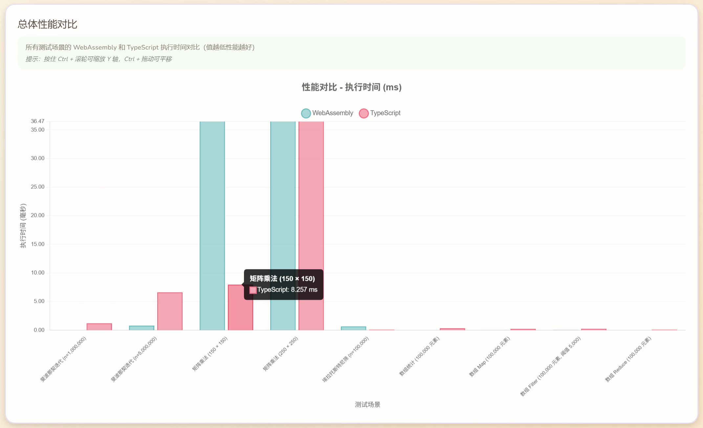
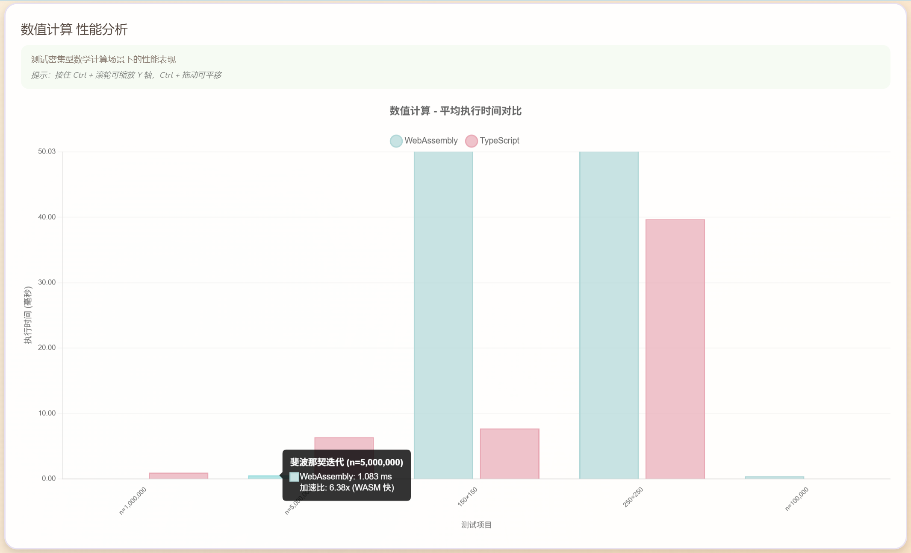
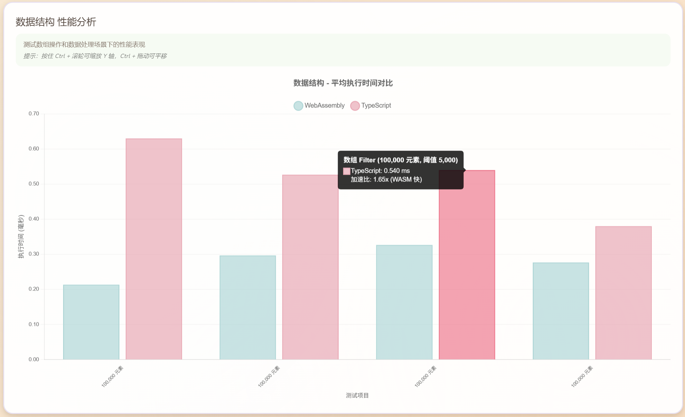
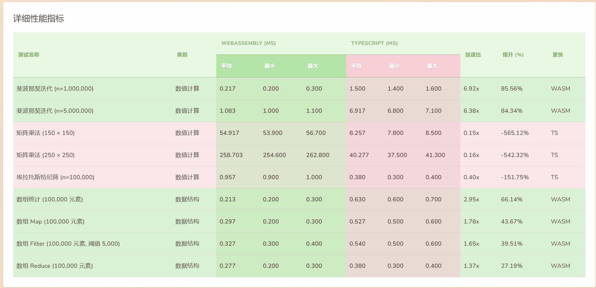
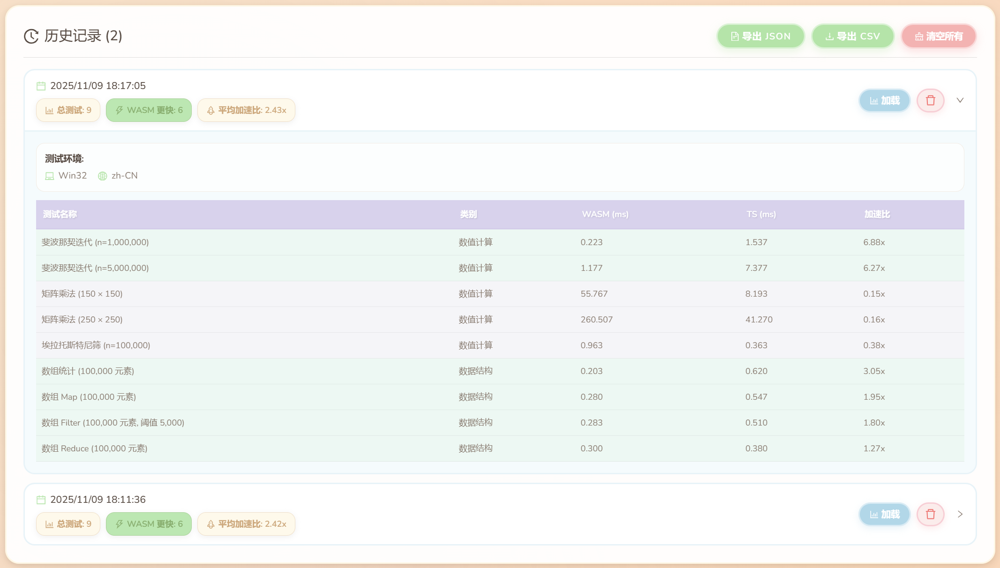

# WebAssembly vs TypeScript 性能基准测试

<div align="center">

[](https://fqfangqi.github.io/wasm-vs-ts/)
[](../LICENSE)
[](https://reactjs.org/)
[](https://www.typescriptlang.org/)
[](https://www.assemblyscript.org/)

通过 AssemblyScript 将 TypeScript 代码编译为 WebAssembly，对比性能差异的全面基准测试工具，具有交互式可视化和可配置的测试场景。

**中文** | **[English](README.md)**

</div>

---

## 📋 项目简介

本项目提供了一个全面的性能对比工具，用于比较通过 **AssemblyScript** 编译的 **WebAssembly** 和原生 **TypeScript** 代码的执行性能。项目支持实时基准测试、交互式图表和详细的性能指标分析。

**在线演示**: https://fqfangqi.github.io/wasm-vs-ts/

## ✨ 功能特性

- 🔬 **全面测试**: 涵盖数值计算、字符串处理、数据结构操作等多种场景
- 📊 **交互式可视化**: 使用 Chart.js 绘制精美图表，支持缩放和平移
- 🔍 **图表缩放**: 按住 `Ctrl` + 鼠标滚轮缩放 Y 轴，`Ctrl` + 拖动平移
- ⚡ **实时基准测试**: 在浏览器中直接运行测试，实时显示进度
- 📈 **详细指标**: 展示平均值、最小值、最大值、标准差和加速比
- 💾 **数据导出**: 支持导出 CSV 或 JSON 格式的测试结果
- ⚙️ **参数可配置**: 自定义测试数据规模和场景
- 🛡️ **安全限制**: 内置参数上限保护，防止浏览器卡顿
- 🌍 **国际化支持**: 中英文双语界面
- 📜 **历史记录**: 保存和对比多次测试结果

## 📸 界面截图

### 主界面


主界面提供了直观的布局，包括配置面板、免责声明、测试建议和测试结果摘要。

### 总体性能对比



所有测试场景的 WebAssembly 和 TypeScript 执行时间可视化对比。

### 数值计算性能分析



测试密集型数学计算场景下的性能表现，包括斐波那契数列、矩阵乘法和埃拉托斯特尼筛法。

### 数据结构性能分析



测试数组操作和数据处理场景下的性能表现。

### 性能加速比分析


显示 TypeScript 相对于 WebAssembly 的性能倍数（大于1表示WASM更快，小于1表示TS更快）。

### 详细性能指标



全面的性能指标表格，显示所有测试场景的平均、最小、最大时间、加速比和提升百分比。

### 历史记录



保存和对比多次测试运行结果，并包含详细的环境信息。

## 🧪 测试场景

### 数值计算

- **斐波那契数列**（迭代法）: 测试循环性能和整数运算
- **矩阵乘法**: 评估嵌套循环效率和浮点运算性能
- **埃拉托斯特尼筛法**: 质数计算算法测试

### 数据结构操作

- **数组统计**: 大型数组的求和、均值、最小值、最大值计算
- **数组 Map**: 数组元素转换操作
- **数组 Filter**: 数组条件过滤
- **数组 Reduce**: 数组累加操作

## 🛠 技术栈

- **前端框架**: React 19 + TypeScript
- **构建工具**: Vite
- **WebAssembly**: AssemblyScript 0.28+
- **图表库**: Chart.js + react-chartjs-2 + chartjs-plugin-zoom
- **国际化**: i18next + react-i18next
- **样式**: CSS3

## 🚀 快速开始

### 环境要求

- Node.js 18+ 和 npm
- 支持 WebAssembly 的现代浏览器

### 安装

```bash
# 克隆仓库
git clone https://github.com/FQFangQi/wasm-vs-ts.git
cd wasm-vs-ts

# 安装依赖
npm install
```

### 编译 WebAssembly 模块

```bash
npm run asbuild
```

这将在 `build/` 目录生成优化后的 WASM 模块（包括 debug 和 release 版本）。

### 启动开发服务器

```bash
npm run dev
```

在浏览器中打开显示的本地地址（通常是 `http://localhost:5173`）。

### 构建生产版本

```bash
npm run build
```

生产版本文件将输出到 `dist/` 目录。

### 预览生产版本

```bash
npm run preview
```

## 📝 使用方法

1. **配置参数**（可选）:
   - 点击"参数配置"按钮打开配置面板
   - 调整测试参数，如数组大小、矩阵维度等
   - 参数会自动限制在安全范围内
   - 点击"恢复默认"可重置所有参数

2. **运行基准测试**:
   - 点击"运行基准测试"按钮
   - 等待测试完成（实时显示进度）

3. **查看结果**:
   - **图表**: 执行时间的可视化对比
     - 使用 `Ctrl` + 滚轮缩放 Y 轴
     - 使用 `Ctrl` + 拖动平移图表
     - 双击重置视图
   - **表格**: 详细的性能指标
   - **摘要**: 总体统计和加速比
   - 绿色指示: WASM 更快
   - 红色指示: TypeScript 更快

4. **导出数据**:
   - 点击"导出 CSV"获取表格兼容格式
   - 点击"导出 JSON"获取机器可读格式

5. **历史记录**:
   - 查看以往的测试结果
   - 加载和对比不同的测试运行
   - 按需清除历史记录

## 📊 性能指标说明

- **平均时间**: 多次迭代的平均执行时间
- **最小/最大时间**: 记录的最快/最慢执行时间
- **标准差**: 性能一致性的度量（越低越稳定）
- **加速比**: TypeScript 时间 ÷ WASM 时间（>1 表示 WASM 更快）
- **性能提升**: WASM 相对于 TypeScript 的百分比提升

> **注意**: 结果采用修剪平均法（去除最高和最低 20% 的样本）以提高准确性和稳定性。

## ⚙️ 配置限制

为防止浏览器卡顿，强制执行以下最大限制：

- **数组大小**: 1,000,000 个元素
- **矩阵大小**: 500 × 500
- **斐波那契 N**: 10,000,000
- **质数上限**: 1,000,000

## 📁 项目结构

```
wasm-vs-ts/
├── assembly/                  # AssemblyScript 源代码
│   ├── index.ts              # WASM 入口点
│   ├── numeric.ts            # 数值计算测试
│   ├── datastructure.ts      # 数据结构测试
│   └── tsconfig.json
├── src/                      # React 前端源码
│   ├── components/
│   │   ├── BenchmarkRunner.tsx    # 测试运行器组件
│   │   ├── ResultsChart.tsx       # 图表可视化
│   │   ├── MetricsTable.tsx       # 结果表格
│   │   └── History.tsx            # 历史记录
│   ├── benchmarks/           # TypeScript 实现
│   │   ├── numeric.ts
│   │   └── datastructure.ts
│   ├── utils/
│   │   ├── benchmark.ts      # 基准测试工具
│   │   ├── wasm-loader.ts    # WASM 加载器
│   │   └── storage.ts        # LocalStorage 工具
│   ├── i18n/                 # 国际化
│   │   ├── index.ts
│   │   └── locales/
│   │       ├── en.ts
│   │       └── zh.ts
│   ├── types.ts              # TypeScript 类型定义
│   ├── App.tsx
│   └── main.tsx
├── build/                    # 编译后的 WASM 文件
├── dist/                     # 生产构建输出
├── docs/                     # 文档
│   ├── images/              # 截图
│   │   ├── en/              # 英文截图
│   │   └── zh/              # 中文截图
│   ├── README.md            # 英文文档
│   └── README.zh-CN.md      # 中文文档
├── public/
├── package.json
├── vite.config.ts
├── asconfig.json             # AssemblyScript 配置
└── README.md
```

## 🧩 添加自定义测试

### 1. 添加 WebAssembly 实现

编辑 `assembly/numeric.ts` 或 `assembly/datastructure.ts`:

```typescript
export function myCustomTest(n: i32): i32 {
  // 你的实现
  return result;
}
```

在 `assembly/index.ts` 中导出:

```typescript
export { myCustomTest } from './numeric';
```

重新编译:

```bash
npm run asbuild
```

### 2. 添加 TypeScript 实现

编辑 `src/benchmarks/numeric.ts` 或 `src/benchmarks/datastructure.ts`:

```typescript
export function myCustomTest(n: number): number {
  // 与 WASM 版本相同的逻辑
  return result;
}
```

### 3. 添加测试套件

在 `src/components/BenchmarkRunner.tsx` 中，同时添加到 `wasmSuites` 和 `tsSuites`:

```typescript
{
  name: '我的自定义测试',
  category: '数值计算',
  testFn: () => wasm.myCustomTest(1000)
}
```

## 💡 性能洞察

### 何时使用 WebAssembly

✅ **适合的场景**:
- CPU 密集型计算
- 加密解密操作
- 图像/视频/音频处理
- 游戏引擎和物理模拟
- 科学计算和数据分析
- 移植现有的 C/C++/Rust 代码

❌ **不推荐的场景**:
- DOM 操作
- 简单的业务逻辑
- 需要频繁与 JavaScript 交互的操作
- 大量字符串处理（WASM 中开销大）
- 小型、短暂的计算

### 优化建议

1. **最小化 WASM-JS 边界交互**: 批量传输数据，减少函数调用频率
2. **使用合适的数据类型**: 利用 WASM 的静态类型提升性能
3. **优化内存访问**: 顺序内存访问比随机访问更快
4. **选择合适的优化级别**: 在编译时间和运行性能之间平衡
5. **先分析后优化**: 始终先测量再优化

## 📖 最佳实践

- **在目标环境测试**: 性能在不同浏览器和设备上有差异
- **关闭后台应用**: 为获得准确的基准测试，最小化系统负载
- **多次运行**: 对多次运行结果取平均值以保持一致性
- **使用发布版本**: 始终测试 WASM 发布版本，而非调试版本
- **考虑包大小**: WASM 会增加应用程序包体积

## 🌐 浏览器兼容性

- ✅ Chrome/Edge 57+（推荐）
- ✅ Firefox 52+
- ✅ Safari 11+
- ✅ Opera 44+
- ⚠️ 需要 WebAssembly 支持

## 🤝 贡献

欢迎贡献！请随时提交 Issue 和 Pull Request。

1. Fork 本仓库
2. 创建你的特性分支 (`git checkout -b feature/amazing-feature`)
3. 提交你的更改 (`git commit -m 'Add some amazing feature'`)
4. 推送到分支 (`git push origin feature/amazing-feature`)
5. 打开一个 Pull Request

## 📄 许可证

本项目采用 MIT 许可证 - 详见 [LICENSE](../LICENSE) 文件。

## 📚 相关资源

- [AssemblyScript 文档](https://www.assemblyscript.org/)
- [WebAssembly 官方网站](https://webassembly.org/)
- [MDN WebAssembly 指南](https://developer.mozilla.org/zh-CN/docs/WebAssembly)
- [Chart.js 文档](https://www.chartjs.org/)

## 🙏 致谢

- 各位朋友送的 star
- AssemblyScript 社区
- 所有为本项目做出贡献的开发者

---

用 ❤️ 打造，源自社区

